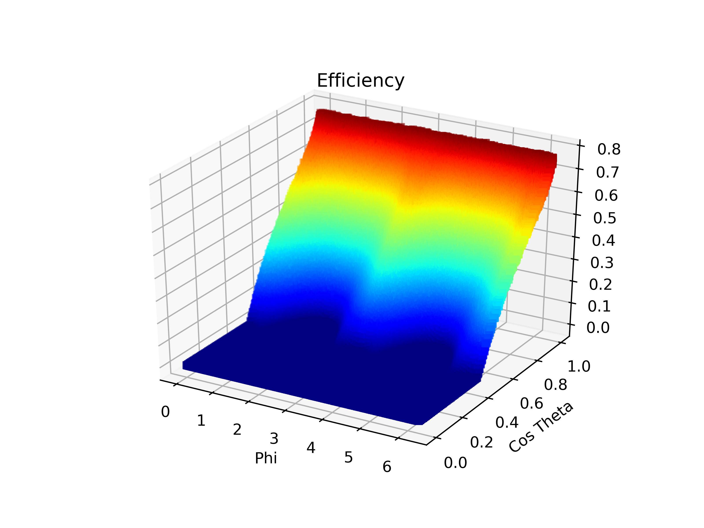
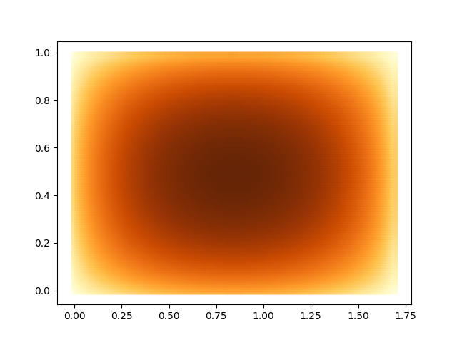
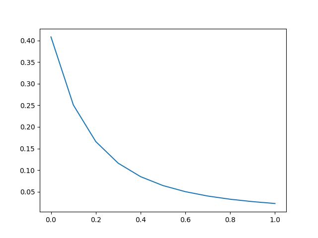

# CERNGraph

A C++ tool for modelling luminosity distribution in a three-layered high-voltage chamber exposed to a muon shower

## Angle distribution

## Area distribution

## Integral distribution

